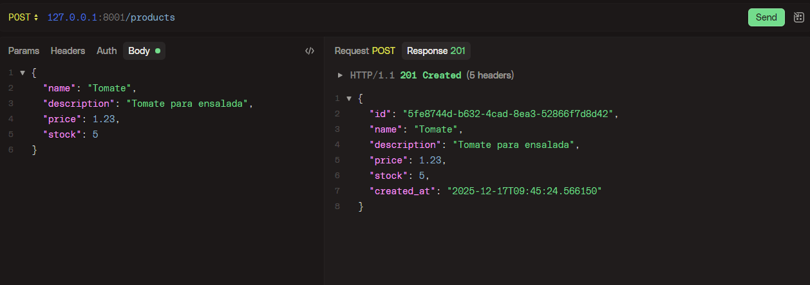
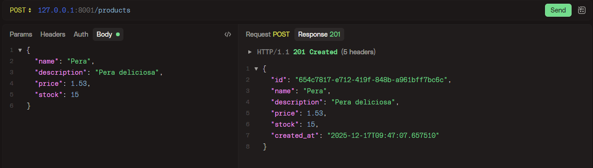
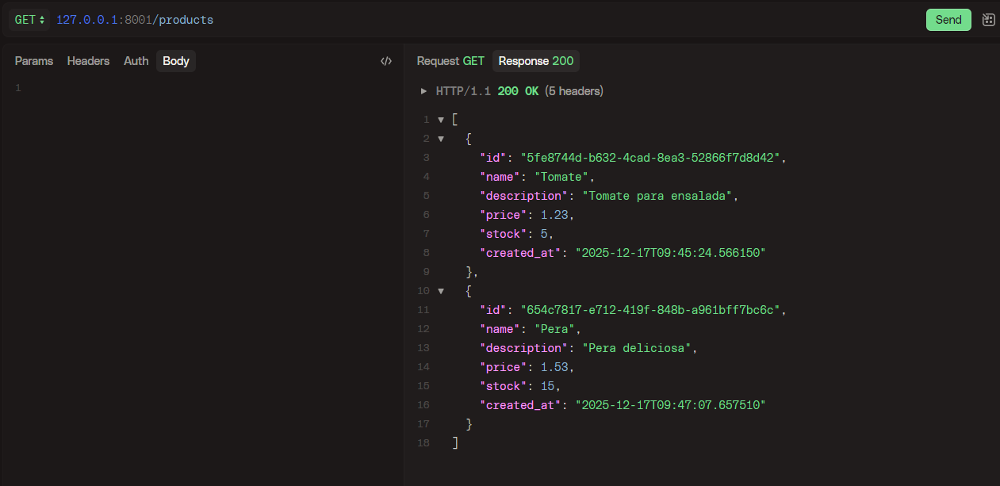
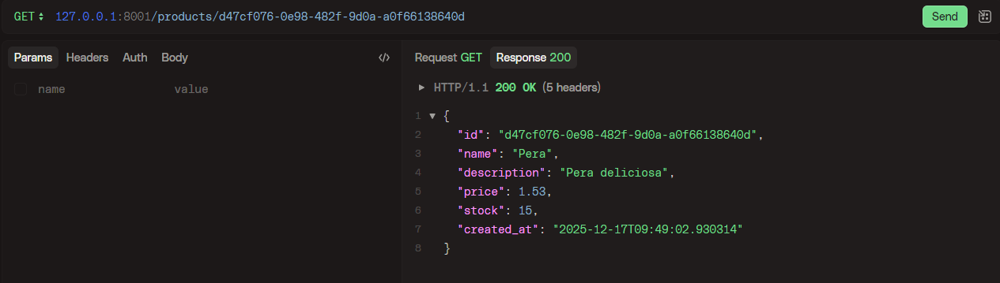
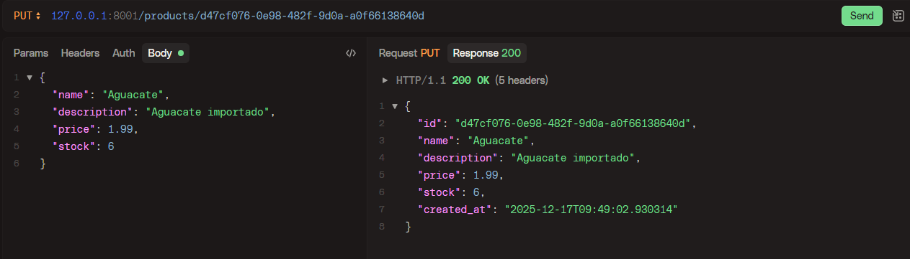
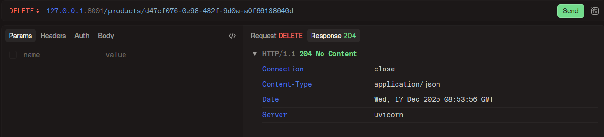
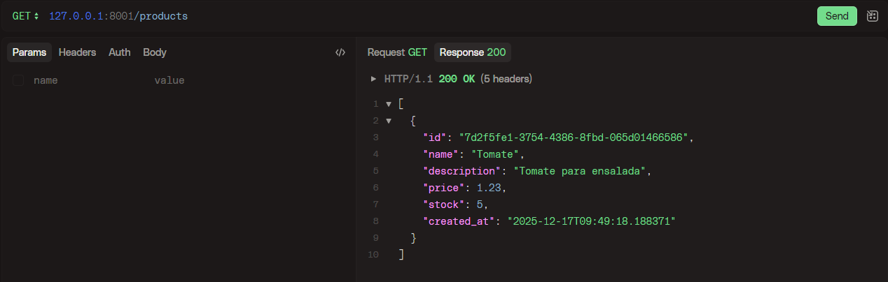

# fast-api-2

*MVC con FastAPI*

*Primero crear en entorno venv con el comando "python -m venv venv"*
*Instalar las dependencias de fastapi y uvicorn con el comando "pip install fastapi uvicorn"*

*Primero hemos comenzado a programar el modelo de producto, lo siguiente ha sido la capa de servicio y por último la capa de controlador*
*Creamos el enrutador principal en el main y comenzamos a verificar los endpoints, en mi caso utilizo la herramienta HTTPie*

*Crear producto*

*Listar productos*

*Buscar producto por UUID*

*Actualizamos un producto*

*Listamos de nuevo para comprobar su correcta actualización*

*Eliminamos uno mediante UUID*

*Listamos de nuevo para comprobar su correcta eliminación*

*Y con esto ya habríamos finalizado el CRUD básico de un producto*
*Acordaros que para levantar el servidor con uvicorn utilizamos el comando "uvicorn main:app --reload --port 8001" especificando el puerto y estando ubicados en el directorio donde se encuentra el fichero main.py*

*Creado por Octavio Bernal*
*17/12/2025*